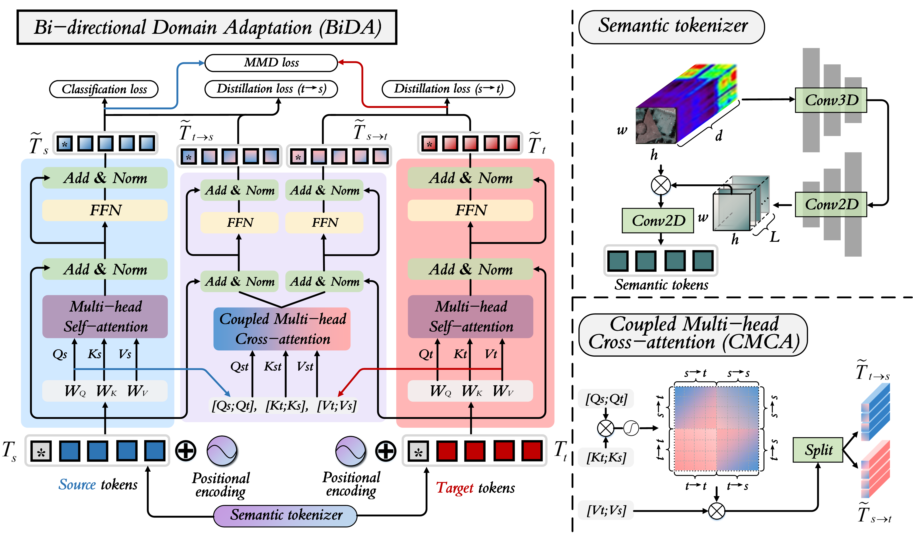

<h1 align="center"><a href="https://ieeexplore.ieee.org/abstract/document/11072185" style="color:#9C276A">
Cross-domain Hyperspectral Image Classification based on Bi-directional Domain Adaptation</a></h1>
<h4 align="center"> If our project helps you, please give us a star ⭐ on GitHub to support us.</h4>

<div align="center">

[[Paper 📰]](https://ieeexplore.ieee.org/abstract/document/11072185) [[Datasets 🤗]](https://github.com/YuxiangZhang-BIT/Data-CSHSI)

</div>

## Overview

This repository provides a PyTorch implementation of **Cross-Domain Hyperspectral Image Classification Based on Bi-Directional Domain Adaptation (BiDA)** for cross-temporal and cross-scene hyperspectral image classification.



## Environment Setup

### 1. Create a Python environment

Python 3.9+ is recommended.

```bash
conda create -n bida python=3.10 -y
conda activate bida
```

### 2. Install PyTorch

Please install PyTorch according to your CUDA version from the official guide:

https://pytorch.org/get-started/locally/

Example (CUDA 12.1):

```bash
pip install torch torchvision torchaudio --index-url https://download.pytorch.org/whl/cu121
```

### 3. Install the remaining dependencies

```bash
pip install -r requirements.txt
```

## Data Preparation

The default entry script runs the Houston cross-temporal task. Default arguments in `main.py` are:

- `source_name=Houston13`
- `target_name=Houston18`
- `dataset_dir=./Houston/`

Please organize the dataset as follows (for the default configuration):

```text
./Houston/
├── Houston13.mat
├── Houston13_7gt.mat
├── Houston18.mat
└── Houston18_7gt.mat
```

The `.mat` files should include the keys expected by the loader:

- `Houston13.mat` / `Houston18.mat`: `ori_data`
- `Houston13_7gt.mat` / `Houston18_7gt.mat`: `map`

## Training and Evaluation

```bash
python main.py \
	--model BiDA \
	--source_name Houston13 \
	--target_name Houston18 \
	--dataset_dir ./Houston/ \
	--device 0 \
	--epoch 200 \
	--bs 128 \
	--lr 1e-2 \
	--patch_size 13 \
	--depth 3 \
	--num_tokens 4 \
	--seed 2100
```

Typical artifacts:

- `model_ts_best*.pth`: model checkpoint with best OA
- `results_*.mat`: statistics including OA and confusion matrix

## Key Arguments

- `--ratio`: source-domain train/validation split ratio (default: `0.95`)
- `--lambda1`: weight for alignment and distillation losses (default: `1e-1`)
- `--lambda2`: weight for consistency loss (default: `1e+0`)
- `--ema_decay`: EMA decay factor (default: `0.999`)
- `--re_ratio`: source-domain repetition ratio (default: `1`)

## Citation

If this repository is useful for your research, please cite:

```bibtex
@ARTICLE{11072185,
	author={Zhang, Yuxiang and Li, Wei and Jia, Wen and Zhang, Mengmeng and Tao, Ran and Liang, Shunlin},
	journal={IEEE Transactions on Circuits and Systems for Video Technology},
	title={Cross-Domain Hyperspectral Image Classification Based on Bi-Directional Domain Adaptation},
	year={2025},
	volume={35},
	number={12},
	pages={12038-12051},
	doi={10.1109/TCSVT.2025.3586282}
}
```